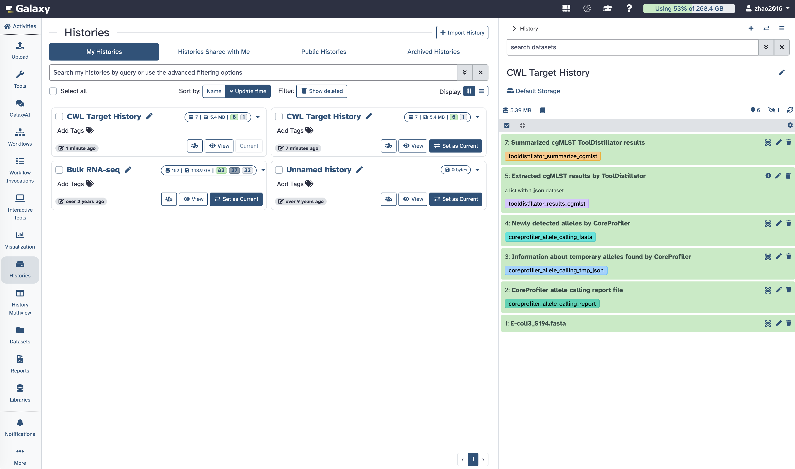

# Test run: cgMLST workflow against usegalaxy.org

**Date:** 2026-09-16
**Command:** `scripts/run_workflow_tests.sh workflow.ga` (fetched via
`scripts/fetch_iwc_workflow.py bacterial-cgmlst`)
**Mode:** online / remote — `GALAXY_URL=https://usegalaxy.org` +
`GALAXY_USER_KEY` (see `SETUP.md`'s "Where does the data actually go?"
section — this mode uploads data and executes on usegalaxy.org's own
compute, not locally)
**Result:** ✅ passed

## What was tested

The real IWC workflow **"core genome Multilocus Sequence Typing (cgMLST) of
Bacterial Genome"** (`workflows/bacterial_genomics/cgmlst-bacterial-genome`
in the IWC registry), using its own shipped test spec
(`cgmlst_bacterial_genome-tests.yml`) — not a synthetic or simplified test.

- **Input:** a real *E. coli* genome assembly FASTA
  (`E-coli3_S194.fasta`, from Zenodo:
  https://zenodo.org/records/16779020/files/E-coli3_S194.fasta)
- **Reference scheme:** `coreprofiler_downloaded_2026-01-15-escherichia_v1-cgMLST-2513-enterobase-no_token`
  — an Enterobase-derived *E. coli* cgMLST scheme, 2,513 loci
- **Steps executed:** `CoreProfiler allele_calling` → `ToolDistillator` →
  `ToolDistillator Summarize`

## planemo's result

```
Invocation <c6302f905da21fcc>
Steps ◆ 100% ◆ 5/5 scheduled
Jobs  ◆ 100% ◆ 3/3 terminal
Job States ◆ 🟢 3

All 1 test(s) executed passed.
workflow.ga_0: passed
```

`tool_test_output.json` summary: `{"num_errors": 0, "num_failures": 0,
"num_skips": 0, "num_tests": 1}`.

All four output assertions from the workflow's own test spec passed:
a specific known locus ID present in the allele-calling report, the report
having exactly 2,514 columns (2,513 loci + 1 ID column), the new-alleles
output being FASTA-formatted, the temporary-alleles output containing
`tmp_loci`, and the aggregated JSON summary containing the expected keys.

## Visual confirmation on usegalaxy.org

The same run, viewed directly in the Galaxy web UI (History → "CWL Target
History"), showing all 7 datasets produced by the 3 completed jobs:



## Independent confirmation via the Galaxy API

Cross-checked directly against usegalaxy.org's API (not just planemo's own
report or the screenshot above) for the same invocation:

```
GET /api/invocations/c6302f905da21fcc
  state: scheduled
  steps: 5/5 scheduled (2 inputs, 3 tools)

GET /api/invocations/c6302f905da21fcc/jobs_summary
  {"states": {"ok": 3}, "populated_state": "ok"}
```

Three independent sources — planemo's exit code/report, the Galaxy web UI
screenshot, and the raw Galaxy API — all agree: all 3 jobs completed with
status `ok`.

## What this confirms

This is the first real, end-to-end confirmation that
`scripts/run_workflow_tests.sh` actually works against a live Galaxy
instance — not just that the script's CLI flags are correct (verified
earlier against `planemo test --help`), but that a fetched IWC workflow
runs correctly against real data and passes its own regression test. See
`scripts/README.md`'s status table, updated to reflect this.
